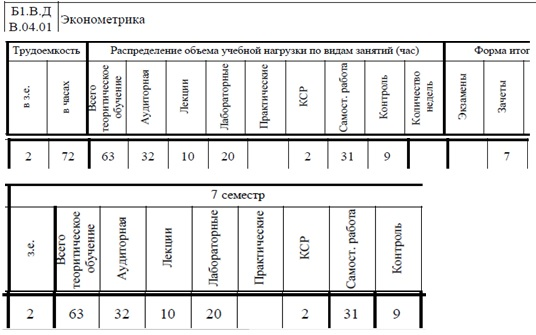

# Эконометрика
## Учебные материалы

### Учебное пособие
Арьков В.Ю. Эконометрические оценки : Учебное пособие. — [б. м.] : Издательские решения, 2021. — 276 с.

https://ridero.ru/books/ekonometricheskie_ocenki/

### Лабораторные работы
Арьков В.Ю. Введение в эконометрику : Учебное пособие. — [б. м.] : Издательские решения, 2021. — 170 с.

https://ridero.ru/books/vvedenie_v_ekonometriku/

### Учебный план

## Видео на Youtube
Эконометрика

https://www.youtube.com/playlist?list=PLgkPUa9zaIkIk_f8jynInZ11EAH3Nr4g0

Машинное обучение

https://www.youtube.com/playlist?list=PLgkPUa9zaIkJ_EhZOfFLi1SvIJZ4t7AVG

### Лекции

<a href="EC_01_Intro.pdf" target="_blank">1. Введение</a>
